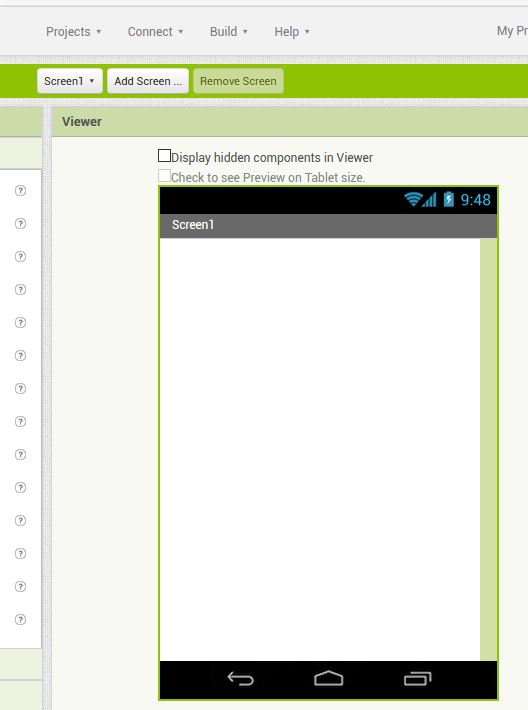
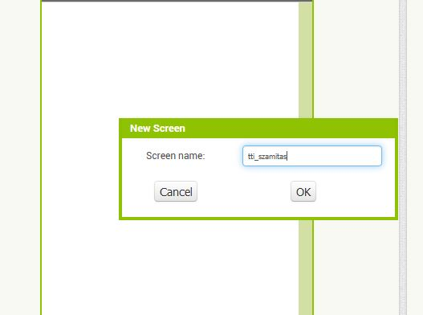
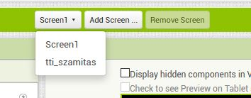
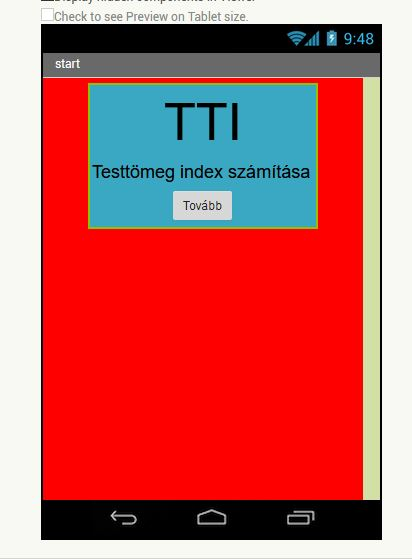

# Testtömeg index számító mobil app készítése
## Új projekt létrehozása
Első lépésként be kell jelentkezni az Appinventor felületére, majd **Projects** menüből a **Start New Project**-et kell választani

## Új képernyő (screen) hozzáadása
Azt szeretnénk, hogy az app egy kezdő képernyővel induljon, amiről gombnyomásra lehet továbbmenni a számításhoz. 
Az **Add Screen**-re kattintva adunk a projekthez új screent. Adjuk neki valami nevet, pl **tti_szamitas** 

A kezdő screen-en alakítsuk ki a következő felületet:

Ehhez a **Layout**-ok közül válasszuk a **VerticalArrangement**-et, húzzuk a **Screen1**-re

A **Screen1**-en az **alignHorizontal** értékét állítsuk **Center**-re

