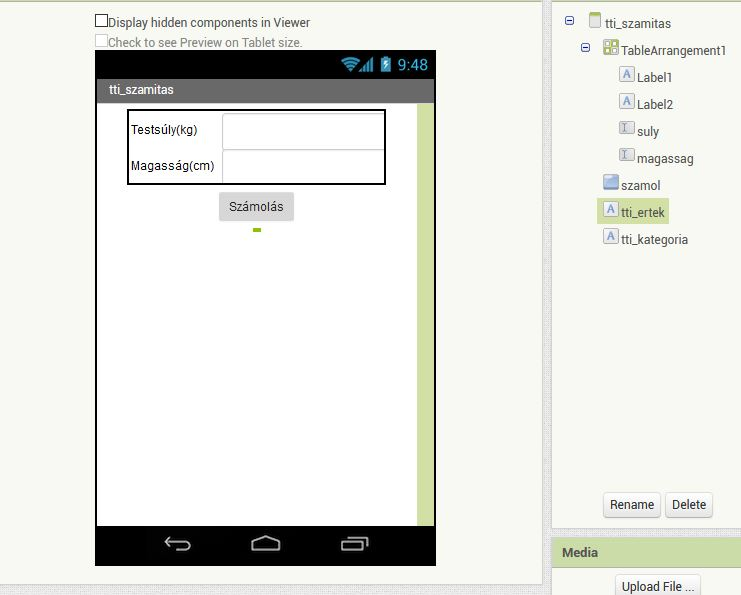
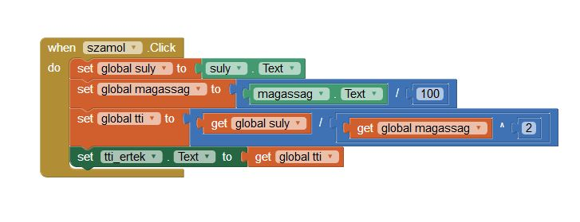

# Testtömeg index számító mobil app készítése
## Új projekt létrehozása
Első lépésként be kell jelentkezni az Appinventor felületére, majd **Projects** menüből a **Start New Project**-et kell választani

## Új képernyő (screen) hozzáadása
Azt szeretnénk, hogy az app egy kezdő képernyővel induljon, amiről gombnyomásra lehet továbbmenni a számításhoz. 
Az **Add Screen**-re kattintva adunk a projekthez új screent. Adjuk neki valami nevet, pl **tti_szamitas** 

A kezdő screen-en alakítsuk ki a következő felületet:

Ehhez a **Layout**-ok közül válasszuk a **VerticalArrangement**-et, húzzuk a **Screen1**-re

A **Screen1**-en az **alignHorizontal** értékét állítsuk **Center**-re

A **VerticalArrangement**-re húzzunk két darab **Label**-t és alájuk egy **Button**-t.
A **Buttont** nevezzük át **tovabb**-ra.
Állítsuk be a **Screen1**-nek, valamint a **VerticalArrangement**-nek is tetszőleges háttérszínt.

A **Screen1**-nél váltsunk át **Blocks** nézetre (jobb felső sarok).

Válasszuk ki a **tovabb** nevű gombunkat. A **Click** eseményt kell megadnunk, ezt húzzuk át jobbra. A parancs amit az esemény bekövetkeztekor végre kell majd hajtania a progranak a **Control** alatt található **Open another screen...** lesz. Ezt húzzuk bele a kódblokkba. Ezt követően a **Text** elemek közül a legfelső kell, amelyben meg kell adni a megnyitni kívánt screen nevét. Ez most a **tti_szamitas** lesz.

## Az eredmény:

Ezzel az első képernyő kész.

Dolgozzuk ki a számítást végző programrész képernyőjét is.

A **tti_szamitas** nevű screen vízszintes igazítását állítsuk be **Center**-re.

A **Layout**-ok közül válasszuk a **TableArrangement**-et, húzzuk a screen-re. Álljon 2 oszlopból és két sorból.
A bal oldali cellákba kerüljön 2 **Label**, a jobb oldalra pedig 2 **TextBox**. Adjunk neveket a **TextBox**-oknak. 

A **TableArrangement** alá tegyünk e gombot, a gomb alá pedig két üres **Label**-t. Ezeken a címkéken jelenik majd meg a TTI értéke, valamint a szöveges tájékoztatás (kövér, sovány stb.)

Ha kész, akkor ezt látjuk majd:

## A programkód összerakása

Váltsunk a **Blocks** gomb lenyomásával a kód szerkesztő módba.
Hozzunk létre három változót 0 kezdőértékkel, ezek fogják tárolni az adatokat.

A változókat a **Variables**-nél, a 0 értéket a **Math**-nál találjuk. A változókat nevezzük el a mintának megfelelően.

A számolás gombnyomásra lesz végrehajtva, tehát a **szamol** gomb **click** eseményénél kell megadni minden további utasítást.

A számolás algoritmusa:

-a súly értékét a megfelelő TextBox-ból beolvassuk a **suly** változóba
-a magasság értékét a megfelelő TextBox-ból beolvassuk a **magassag** változóba, és 100-al elosztjuk, mert a képlet m-el és nem cm-el számol
-kiszámítjuk a testtömeg indexet a megadott adatok alapján
-megjelenítjük az eredményt

### A kódblokk így néz ki:

